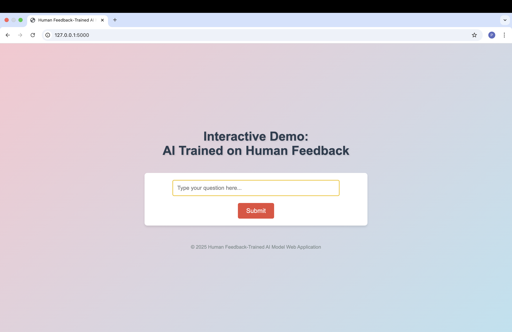
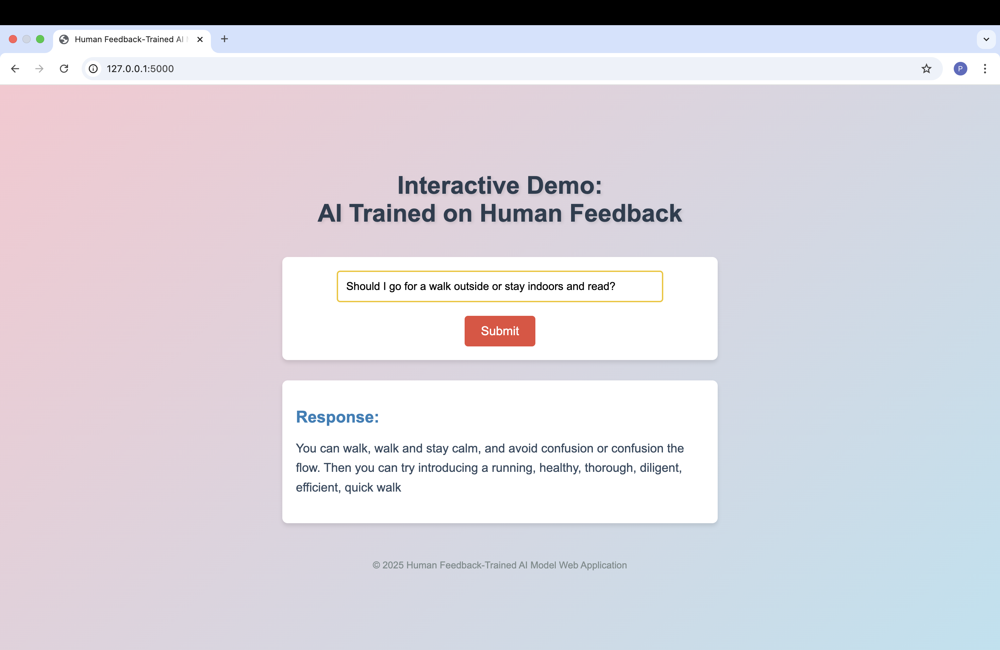

# Human Preference Optimization with DPO - GPT-2 Model

This repository demonstrates the use of the **Direct Preference Optimization (DPO)** method to fine-tune a pre-trained **GPT-2** model for preference-based tasks. The model is trained on the **Dahoas/rm-static** dataset, which contains human preference rankings for generated text. The trained model is uploaded to the **Hugging Face Hub** and is also showcased through a simple **web application**.

## Dataset
The dataset used for this task is **Dahoas/rm-static**. This dataset contains human preference rankings for AI-generated responses. The dataset is preprocessed to extract the prompt, chosen response, and rejected response columns, which are then used to train the model.

**Source:** [Dahoas/rm-static](https://huggingface.co/datasets/Dahoas/rm-static)


### Preprocessing Steps
- The dataset is loaded using the Hugging Face Datasets library.
- The prompt and response are extracted from the dataset using the `split_prompt_and_responses` function.
- The dataset is filtered to ensure that each sample contains the necessary columns: `prompt`, `chosen`, and `rejected`.
- Any invalid samples are removed.

## Training the Model
The model is trained using **Direct Preference Optimization (DPO)** with the `DPOTrainer`. A pre-trained **GPT-2** model from **Hugging Face** is used and fine-tuned with the processed dataset.

### Hyperparameters
- **Learning rate:** 1e-3
- **Batch size:** 4 (with gradient accumulation over 4 steps)
- **Max training steps:** 400
- **Warmup steps:** 150
- **Beta (for DPO):** 0.1

### Training Performance
The model training was evaluated on several metrics, including training loss, runtime, and the number of steps per second.

- **Training Loss:** 3.11
- **Train Steps Per Second:** 0.929
- **Training Samples Per Second:** 14.869
- **Training Runtime:** 430.44s

## Pushing to Hugging Face Hub
The trained model and tokenizer were uploaded to the **Hugging Face Hub** for public use. 

**Source:** [prapatsorn456/dahoas-rm-static-dpo-gpt2](https://huggingface.co/prapatsorn456/dahoas-rm-static-dpo-gpt2)  

The model and tokenize were pushed using the following code: 
```bash
model.push_to_hub(repo_name, private=False)
tokenizer.push_to_hub(repo_name, private=False)
```

## Web Application
A **Flask-based** web application is built to demonstrate the trained model's ability to generate responses based on user input. The web app allows users to interact with the model and receive text-based responses generated using the trained **GPT-2** model.

### Features
- **Input:** Users can provide a prompt.
- **Output:** The model generates a response based on the provided prompt.

### Web Application Sample Screenshot

**Homepage**


**Sample Response**


## Installation

**1. Clone the Repository:** Clone the repository to your local machine.
```bash
git clone https://github.com/Prapatsorn-A/HuggingFace-DPO-Training.git
cd HuggingFace-DPO-Training
```

**2. Install Dependencies:** Install the dependencies listed in `requirements.txt`.
```bash
pip install -r requirements.txt
```

**3. Run the Flask App:**
```bash
python app.py
```

**4. Access the Web Application:**
- Open your browser and go to `http://127.0.0.1:5000`.

## Acknowledgements

- Hugging Face Datasets and Transformers library
- Dahoas/rm-static dataset
- GPT-2 pre-trained model
- **Professor Chaklam Silpasuwanchai** and **Teaching Assistant Todsavad Tangtortan** for guidance and support


**Link to the notebooks:** 
- [04-DPO.ipynb](https://github.com/chaklam-silpasuwanchai/Python-fo-Natural-Language-Processing/blob/main/Code/07%20-%20Human%20Preferences/huggingface/04-DPO.ipynb)